# `graph.md` — TruthLens AI: System Graphs & Flow Diagrams

Visual reference for the complete TruthLens ML pipeline. Each section is a self-contained diagram with a short explanation. Read sequentially for a full system walkthrough, or jump to any section independently.

---

## Table of Contents

1. [High-Level System Architecture](#1-high-level-system-architecture)
2. [Detailed Data Flow Diagram](#2-detailed-data-flow-diagram)
3. [Feature Engineering Pipeline](#3-feature-engineering-pipeline)
4. [Model Architecture](#4-model-architecture)
5. [Training Workflow](#5-training-workflow)
6. [Inference Pipeline](#6-inference-pipeline)
7. [Explainability Flow](#7-explainability-flow)
8. [Evaluation Flow](#8-evaluation-flow)
9. [Component Interaction Graph](#9-component-interaction-graph)
10. [Deployment Architecture](#10-deployment-architecture)
11. [Simple Visual Explanation (Non-Technical)](#11-simple-visual-explanation)

---

## 1. High-Level System Architecture

The TruthLens system is a nine-stage pipeline. Raw news text enters on the left; calibrated, explainable predictions exit on the right.


**Flow summary:**
- `src/data` cleans and tokenises raw text.
- `src/analysis` runs 15+ linguistic detectors (bias, emotion, propaganda, framing, etc.).
- `src/features` fuses hand-crafted features into model-ready tensors.
- `src/models` hosts the `MultiTaskTruthLensModel` (RoBERTa encoder + six task heads).
- `src/training` drives the supervised multi-task learning loop.
- `src/evaluation` measures calibration, uncertainty, and cross-task correlation.
- `src/inference` serves predictions with caching, monitoring, and drift detection.
- `src/explainability` generates SHAP, LIME, and attention-based explanations.

---

## 2. Detailed Data Flow Diagram

Shows every transformation from raw input to final structured report, including the graph subpipeline and aggregation layer.

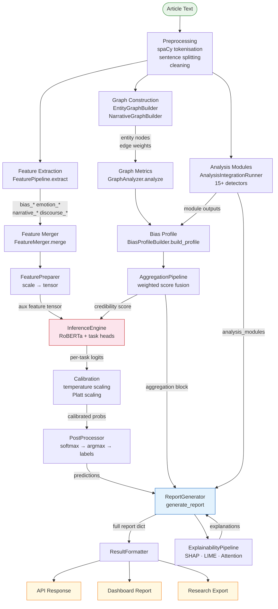

---

## 3. Feature Engineering Pipeline

Three parallel extractor branches feed into a shared fusion layer that produces a single float tensor.

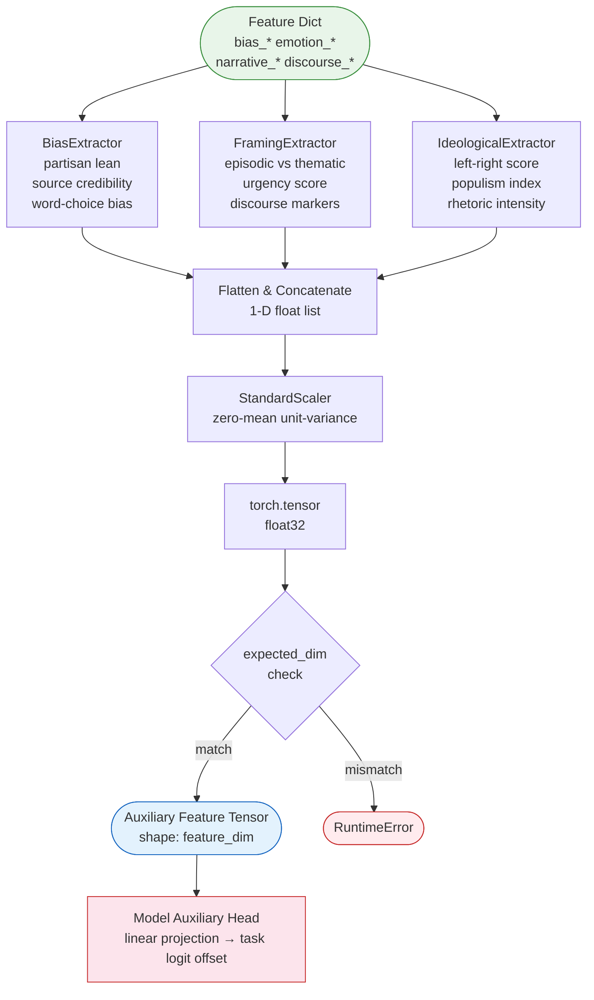

**Feature config flags** (`FeaturePreparationConfig`):

| Flag | Effect |
|---|---|
| `use_bias_features` | Include / exclude `BiasExtractor` branch |
| `use_framing_features` | Include / exclude `FramingExtractor` branch |
| `use_ideological_features` | Include / exclude `IdeologicalExtractor` branch |
| `scale_features` | Apply `StandardScaler` before tensorisation |

---

## 4. Model Architecture

`MultiTaskTruthLensModel` shares a single RoBERTa encoder across all six classification heads.

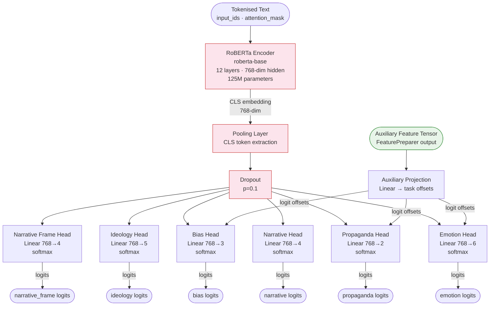

**Checkpoint:** `bhavaygupta2002/truthlens_v1/checkpoint.pt`  
**Encoder:** `roberta-base` (frozen or fine-tuned per training config)  
**Tasks:** emotion · narrative · propaganda · bias · ideology · narrative_frame

---

## 5. Training Workflow

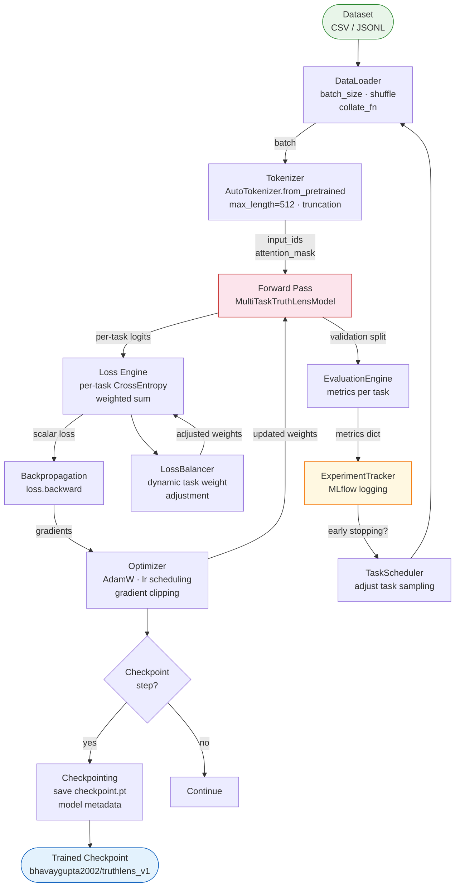

Key training components:

| Component | File | Role |
|---|---|---|
| `Trainer` | `trainer.py` | Outer training loop |
| `LossEngine` | `loss_engine.py` | Weighted multi-task loss computation |
| `LossBalancer` | `loss_balancer.py` | Dynamic per-task weight adjustment |
| `TaskScheduler` | `task_scheduler.py` | Curriculum and task sampling |
| `ExperimentTracker` | `experiment_tracker.py` | MLflow metric/artefact logging |
| `DistributedEngine` | `distributed_engine.py` | Multi-GPU DDP wrapper |

---

## 6. Inference Pipeline

Full request lifecycle from HTTP POST to cached, monitored, logged response.

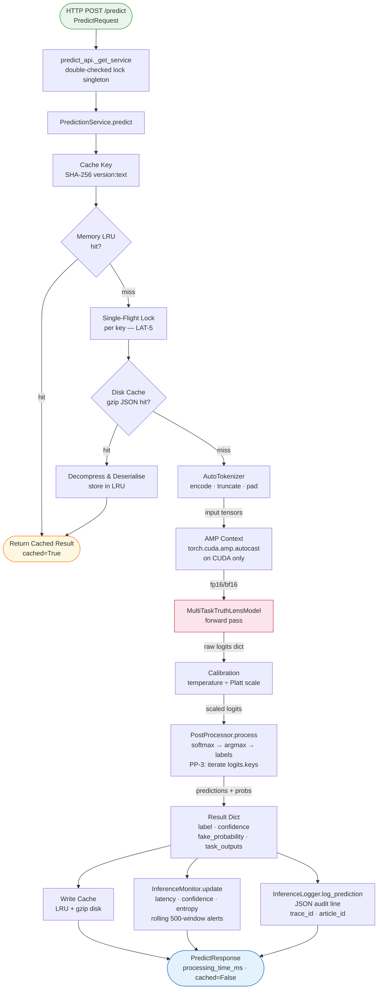

**Batch path** (high-throughput):

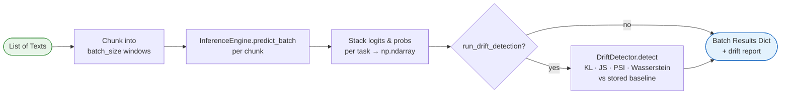

---

## 7. Explainability Flow

Multiple explanation methods run in parallel; results are aggregated, cached, and embedded in the report.

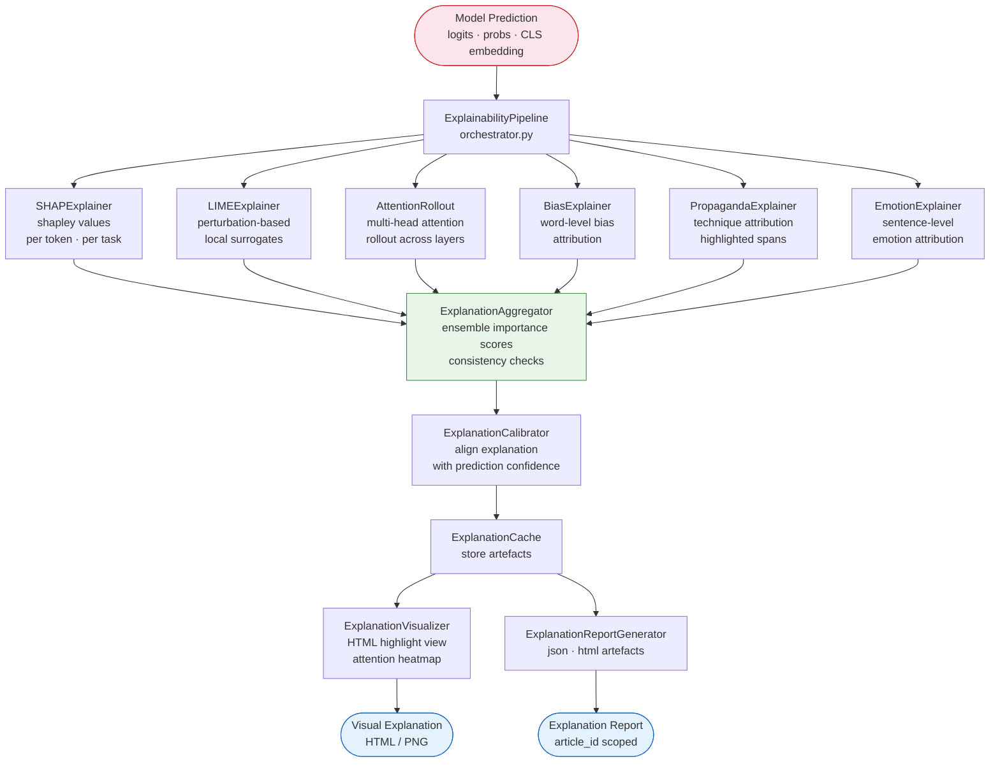

---

## 8. Evaluation Flow

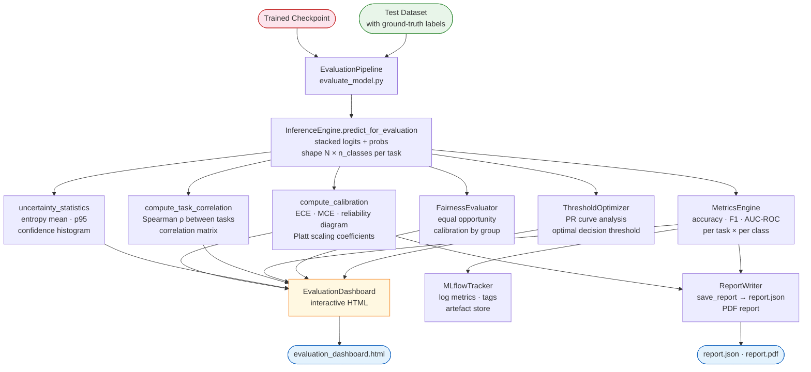

Evaluation outputs:

| Output | Description |
|---|---|
| ECE / MCE | Expected and Maximum Calibration Error |
| Reliability diagram | Confidence-vs-accuracy bucket plot |
| Task correlation matrix | Spearman ρ between all six task probability vectors |
| Uncertainty histogram | Entropy distribution across test set |
| Fairness report | Calibration parity across demographic groups |
| PDF report | Full printable evaluation summary |

---

## 9. Component Interaction Graph

Shows which modules depend on which, across all nine packages.

```mermaid
flowchart TD
    subgraph DATA ["src/data"]
        DL2[DataLoader]
        PRE2[Preprocessor]
    end

    subgraph ANALYSIS ["src/analysis"]
        IR[AnalysisIntegrationRunner]
        BPB[BiasProfileBuilder]
        PPD[PropagandaPatternDetector]
        FA2[FramingAnalysis]
        EA[EmotionTargetAnalysis]
        ARG[ArgumentMining]
        COH[DiscourseCoherenceAnalyzer]
    end

    subgraph GRAPH ["src/graph"]
        EGB[EntityGraphBuilder]
        NGB[NarrativeGraphBuilder]
        GAN[GraphAnalyzer]
        GP[GraphPipeline]
    end

    subgraph FEATURES ["src/features"]
        FPL[FeaturePipeline]
        FMR[FeatureMerger]
        FPR[FeaturePreparer]
    end

    subgraph AGGREGATION ["src/aggregation"]
        AGGP[AggregationPipeline]
        TSC[TruthLensScoreCalculator]
        RM[RiskAssessment]
        WM[WeightManager]
    end

    subgraph MODELS ["src/models"]
        ENC2[RoBERTa Encoder]
        HEADS[Task Heads ×6]
        CAL4[ModelCalibration]
    end

    subgraph TRAINING ["src/training"]
        TR[Trainer]
        LE[LossEngine]
        LB2[LossBalancer]
        ET[ExperimentTracker]
    end

    subgraph EVALUATION ["src/evaluation"]
        EVPL[EvaluationPipeline]
        METR2[MetricsEngine]
        CAL5[compute_calibration]
        CORR2[task_correlation]
    end

    subgraph INFERENCE ["src/inference"]
        IE2[InferenceEngine]
        PS[PredictionService]
        IC[InferenceCache]
        IM[InferenceMonitor]
        DD2[DriftDetector]
        IL[InferenceLogger]
        BIE[BatchInferenceEngine]
        AA[ArticleAnalyzer]
        RG[ReportGenerator]
        RF[ResultFormatter]
    end

    subgraph EXPLAINABILITY ["src/explainability"]
        SE[SHAPExplainer]
        LE2[LIMEExplainer]
        AR[AttentionRollout]
        ERG[ExplanationReportGenerator]
    end

    subgraph API ["api/"]
        APP[FastAPI app.py]
        ROUTER[predict_api router]
    end

    DL2 --> PRE2
    PRE2 --> FPL
    PRE2 --> IR
    PRE2 --> EGB

    FPL --> FMR
    FMR --> FPR
    FPR --> IE2

    IR --> BPB
    BPB --> AGGP
    AGGP --> TSC
    AGGP --> RM
    WM --> AGGP

    EGB --> GAN
    NGB --> GP
    GP --> GAN
    GAN --> BPB

    ENC2 --> HEADS
    HEADS --> CAL4

    IE2 --> ENC2
    IE2 --> CAL4
    IE2 --> PS
    PS --> IC
    PS --> IM
    PS --> IL
    BIE --> IE2
    BIE --> DD2
    AA --> PS
    AA --> AGGP
    AA --> RG
    RG --> RF

    TR --> ENC2
    TR --> LE
    LE --> LB2
    TR --> ET

    EVPL --> IE2
    EVPL --> METR2
    EVPL --> CAL5
    EVPL --> CORR2

    SE --> ERG
    LE2 --> ERG
    AR --> ERG
    ERG --> RG

    APP --> ROUTER
    ROUTER --> PS

    style MODELS fill:#fce4ec,stroke:#c62828
    style INFERENCE fill:#fff8e1,stroke:#f57f17
    style API fill:#e8f5e9,stroke:#388e3c
    style EXPLAINABILITY fill:#e3f2fd,stroke:#1565c0
```

---

## 10. Deployment Architecture

```mermaid
flowchart TD
    subgraph CLIENT ["Client Layer"]
        BR[Browser / API Client]
        CLI2[run_inference.py CLI]
    end

    subgraph REPLIT ["Replit Cloud\n.replit deployment"]
        subgraph BUILD ["Build Phase"]
            B1[pip install torch CPU-only\nindex-url pytorch.org/whl/cpu]
            B2[pip install -r requirements.txt]
            B1 --> B2
        end

        subgraph SERVE ["Runtime — Gunicorn + Uvicorn\n--workers 1 --timeout 120"]
            APP2[FastAPI app.py\nport 5000]
            APP2 --> IR2[/predict\nPredictRequest → PredictResponse]
            APP2 --> IH[/predict/health\nMonitoring snapshot]
            APP2 --> IB[/predict/batch\nBatchPredictRequest]
        end
    end

    subgraph MODEL_STORE ["Model Storage"]
        HF[HuggingFace Hub\nbhavaygupta2002/truthlens_v1\ncheckpoint.pt]
    end

    subgraph CACHE_STORE ["Cache Layer"]
        MLRU[In-process LRU\n512 slots]
        DISK[gzip JSON disk\n.cache/inference/]
    end

    subgraph LOGS ["Observability"]
        JLOG[JSON audit logs\nInferenceLogger]
        MON2[Rolling metrics\nInferenceMonitor]
        DRIFT2[Drift alerts\nDriftDetector]
    end

    BR --> |HTTPS| APP2
    CLI2 --> |direct Python| APP2
    APP2 --> SINGLETON[PredictionService singleton\ndouble-checked lock]
    SINGLETON --> MLRU
    MLRU --> |miss| DISK
    DISK --> |miss| ENG2[InferenceEngine\nloads from MODEL_STORE]
    HF --> ENG2
    ENG2 --> SINGLETON
    SINGLETON --> JLOG
    SINGLETON --> MON2
    SINGLETON --> DRIFT2

    style REPLIT fill:#fffde7,stroke:#f9a825
    style MODEL_STORE fill:#fce4ec,stroke:#c62828
    style CACHE_STORE fill:#e8f5e9,stroke:#388e3c
    style LOGS fill:#e3f2fd,stroke:#1565c0
```

**Deployment constraints:**

| Constraint | Reason |
|---|---|
| CPU-only torch wheel | CUDA torch exceeds the 8 GiB image limit |
| `--workers 1` | Prevents duplicate model loads (one 500 MB model per worker) |
| `--timeout 120` | Accommodates first-request CUDA warm-up / cold start |
| Disk cache sharding | `key[:2]` subdirectory prefix prevents flat-directory FS slowdown |

---

## 11. Simple Visual Explanation

For non-technical reviewers: what TruthLens actually does, in plain language.

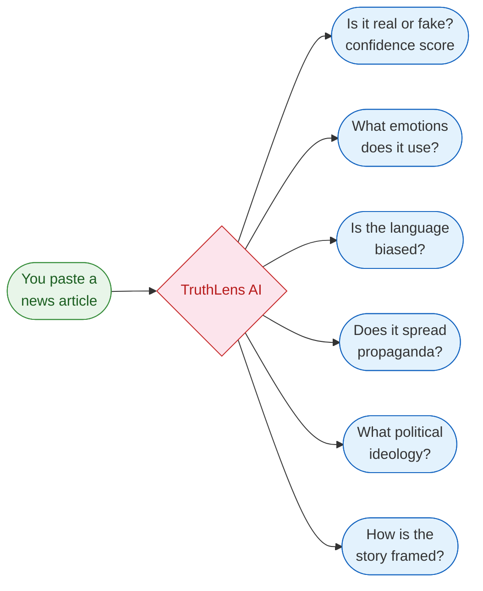

**Plain-language walkthrough:**

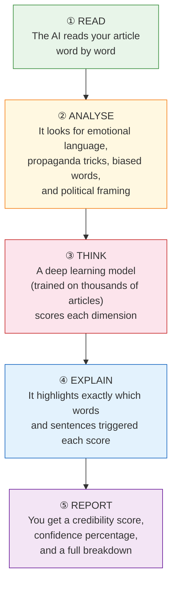

**What each score means:**

| Output | Plain meaning |
|---|---|
| `fake_probability` | How likely the article contains misinformation (0 = trustworthy, 1 = likely fake) |
| `emotion` | Which emotion the article tries to provoke (fear, anger, joy, etc.) |
| `bias` | Whether the language leans politically left, centre, or right |
| `propaganda` | Whether the article uses known influence techniques |
| `ideology` | The political worldview underlying the article |
| `narrative_frame` | How the story is packaged (conflict, human interest, economic, etc.) |
| `credibility_score` | Single 0–100 aggregate score from all dimensions combined |

---

## Legend

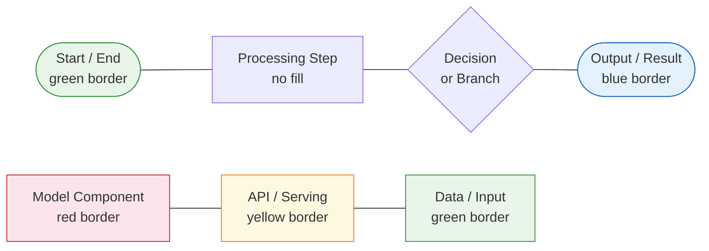

| Colour | Meaning |
|---|---|
| Green border | Raw data input or final output |
| Red border | Neural network / model components |
| Blue border | Structured results and reports |
| Yellow border | API, serving, and cache layer |
| No fill | Internal processing steps |
